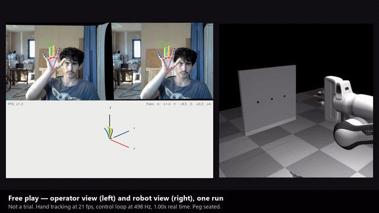

# AI-Assisted Robotic Teleoperation for Precision Insertion

A simulated robotic arm performs peg-in-hole insertions under shared-autonomy control: a human operator provides coarse 6-DoF commands (webcam-tracked hand motion), and a vision-conditioned residual policy issues real-time micro-corrections intended to absorb the human's aim error.

**The result is negative.** Across five production recipes retrained over training seeds and evaluated on 100 paired held-out walls, no recipe lifts insertion success above the human-only baseline beyond training-seed noise, and no reduction in contact force is established either. What the project contributes is a bound on the assist's authority that holds by construction, and a mechanism-level account of why per-step imitation cannot lift closed-loop seating on this task — see **[docs/conclusions.md](./docs/conclusions.md)**.

## Demo

A 69-second walkthrough: live stereo-hand teleoperation, four takes from the blinded
human-operator trial, assistance on against off, and what the measurements actually support.

[](./assets/media/demo.mp4)

▶ **Watch the full 69 s: [assets/media/demo.mp4](./assets/media/demo.mp4)** (4.2 MB). The
animation above is a 6-second excerpt of segment 1 — GitHub strips `<video>` tags from
rendered Markdown, so a committed MP4 cannot play inline here and the link is the way in.

Every clip is captioned as what it is: single runs on different walls, not a comparison. The
free-play takes are demonstrations of the tracking pipeline and are *not* measured trials, and
one of them fails. The assist-on/off segment shows the **analytical, privileged-information
expert** — not the trained residual policy, whose success-rate lift was measured and retracted.

Built in [MuJoCo](https://mujoco.org) for the Franka Emika Panda. The residual policy is trained via behavioral cloning against a scripted privileged-info expert. Two configurations — human-only and human + learned residual — are compared head-to-head in a KPI ablation, on a shared always-on impedance backbone.

> **Status**: the simulation, control backbone, assistance seam, expert + data generation, both
> policy arcs (Phase-1 F/T residual, Phase-2 vision), and live stereo-hand teleoperation are
> built and evaluated (**M1–M8**); final evaluation and polish (**M9**) are in progress. To train
> or deploy a policy see [docs/guides/policy-guide.md](./docs/guides/policy-guide.md); for measured
> outcomes see [docs/results/kpi-dashboard.md](./docs/results/kpi-dashboard.md). Per-milestone status:
> [docs/specs/milestones.md](./docs/specs/milestones.md). Full definition: [docs/design-document.md](./docs/design-document.md).

## Project context

Course project for *Workshop in Autonomous Systems Simulation* (OpenU course 20973, fall 2026). Solo project. Final submission deadline: 2026-08-31.

## Documents

- **[docs/conclusions.md](./docs/conclusions.md)** — **read this for the outcome.** What the project set out to do, what it delivered, what every KPI measured, what was not possible and why. The short reading of the whole results set.
- **[docs/design-document.md](./docs/design-document.md)** — **start here for the system.** The submission design document: requirements, system architecture (with architectural diagram and sequence chart), design alternatives and their justification, simulation scenarios, KPIs, challenges and risks, evaluation criteria, timeline.
- **[docs/guides/architecture-tour.md](./docs/guides/architecture-tour.md)** — a guided walk through the code in the order the data flows: operator input → the assistance seam → sim → the episode loop → corpus → policy → evaluation. Start here to find your way around `src/`.
- **[docs/guides/policy-guide.md](./docs/guides/policy-guide.md)** — how to train a policy, deploy one in an episode, and run a paired ablation, as three runnable recipes, plus an inventory of every checkpoint in `outputs/policy/runs/`.
- **[docs/results/](./docs/results/kpi-dashboard.md)** — the results, one file per question: the [noise floor](./docs/results/noise-floor.md) (what retraining moves), the [KPI board](./docs/results/kpi-board.md) (every recipe × every metric), [within-seed](./docs/results/within-seed.md) (one checkpoint, trial by trial), [mechanisms](./docs/results/mechanisms.md) (why it doesn't work) and the [experiment ledger](./docs/results/experiment-ledger.md) (what ran on what data).
- **[docs/results/checkpoints/](./docs/results/checkpoints/)** — every trained policy behind a number in the dashboard, committed so you can run one: `kvn episode --policy tf --checkpoint docs/results/checkpoints/ft/bc/seed_0/checkpoint.pt`.
- **[docs/results/further-exploration.md](./docs/results/further-exploration.md)** — every lever that was tried and what it measured, and the candidates the mechanism findings predict could still move the number.
- **[docs/specs/milestones.md](./docs/specs/milestones.md)** — the M1–M9 plan and per-milestone status; each milestone has its own spec alongside it in [docs/specs/](./docs/specs/).

## Quick start

Requires [uv](https://github.com/astral-sh/uv) (Python 3.12). **After cloning, run
the one-time setup** from this directory:

> **Budget ~10 minutes and ~6 GB of disk on a cold cache.** The default install pulls the
> full runtime stack — PyTorch and its bundled CUDA libraries are most of it — which is a
> 2–3 GB download and a ~6 GB `.venv`. It looks like it has hung; it hasn't.
> Only need to *read* the results? You don't need any of this — the
> [design document](./docs/design-document.md) and
> [KPI dashboard](./docs/results/kpi-dashboard.md) stand on their own.

```bash
./scripts/setup.sh          # everything needed to run the project
./scripts/setup.sh --dev    # the above plus dev tooling (pytest/ruff/mypy) + docs
```

On **WSL2**, the live webcam path additionally needs one system package
(MediaPipe links against it; nothing else does):

```bash
sudo apt install libgles2
```

On Windows (e.g. a run-only copy for the native-camera interactive viewer), use the
PowerShell sibling instead:

```powershell
.\scripts\setup.ps1         # -Dev for the dev tooling + docs
```

That creates the `.venv`, installs the package + extras, enables the git hooks,
and puts a `kvn` launcher on your PATH. The default installs the full **runtime**
stack (policy train/eval, stereo webcam teleop via `stereo-input`, recording, scene
generation); `-D`/`--dev` adds the dev tooling and docs deliverables. Then:

```bash
kvn                       # list every command
kvn smoke --no-viewer     # scene smoke test, headless — start here
kvn episode --headless --seed 7 --max-steps 1500      # one full episode
kvn check                 # the full lint + typecheck + test gate (~1 min)
```

Then run a **trained policy** — every checkpoint behind a number in the results is
committed, so this works straight from a clean clone:

```bash
kvn episode --policy tf --headless \
  --checkpoint docs/results/checkpoints/ft/bc/seed_0/checkpoint.pt
```

**Anything with a viewer needs a display.** `kvn sim --seed 7` and `kvn episode` without
`--headless` open an interactive OpenGL window: they need X11 (or WSLg on WSL2), and they
block until you close the window. Without a display they exit with
`could not initialize GLFW`. Offscreen rendering — `kvn smoke`, the wrist camera, recording
— works headless with no display at all.

`kvn` (pronounced *"Kevin"*) is the project's command-line front door — one entry
point for the whole workflow instead of `uv run python scripts/...`. `kvn` (or
`kvn --help`) lists commands; `kvn <command> --help` shows a command's flags. Full
reference: **[docs/guides/cli.md](./docs/guides/cli.md)**.

> Don't want the PATH launcher on your `PATH`? `uv run kvn <command>` works from the repo
> root after setup, and `KVN_BIN_DIR=/some/dir ./scripts/setup.sh` puts the launcher
> elsewhere. **Use `setup.sh`, not `uv pip install -e .` —** the script runs `uv sync`
> against the committed `uv.lock`, and a bare `uv pip install` re-resolves from scratch and
> has picked a cadquery→numba→llvmlite chain that will not build on 3.12.

## Input strategies

The operator's coarse command source is swappable behind a common seam; pick one
at runtime with `kvn episode --input {scripted,vision}` (default `scripted`):

- **scripted** — a deterministic, seedable "noisy human". No hardware; used for
  data generation and repeatable KPI benchmarking. This is the default.
- **vision** — live **two-webcam stereo** hand tracking via the standalone
  [stereohand](https://github.com/NavehBrenner/stereohand) package: metric 3D hand
  pose + 6-DoF mirroring. Move your hand to drive the arm; lift it out of frame (or
  hold an open palm still for 3 s) to re-anchor; make a fist to squeeze, open your
  hand to release. Needs the `stereo-input` extra, a one-time stereo calibration,
  and the viewer (no `--headless`).

A keyboard fallback was scoped in M8 and **dropped** — `scripted` covers repeatable
benchmarking and `vision` covers the live demo, so nothing needed it.

### Stereo (vision) setup

`setup.sh` already installs the `stereo-input` extra (it is in the default tier), so
`stereohand` and its OpenCV + MediaPipe are present after setup — nothing extra to install.

You need two rigidly co-mounted webcams and a one-time ChArUco stereo calibration
(`stereo_calib.json`) — see the [stereohand](https://github.com/NavehBrenner/stereohand)
README for the calibration walkthrough. Then:

```bash
kvn episode --input vision --stereo-calib stereo_calib.json --cameras 0 2
```

**WSL2** — WSL's kernel has no webcam (UVC) driver, so there's no `/dev/video*`. Stream
both cameras from Windows and pass their URLs to `--cameras`, e.g.
`--cameras "http://<windows-host>:8080/0" "http://<windows-host>:8080/1"`. The
Windows-side camera bridge (`stream_webcams.py`) and a full step-by-step WSL walkthrough
live in the stereohand project.

## License

To be added (likely MIT).
