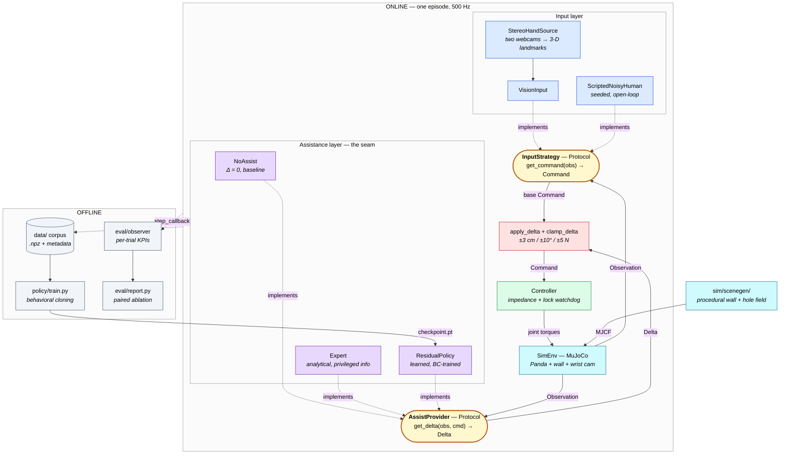
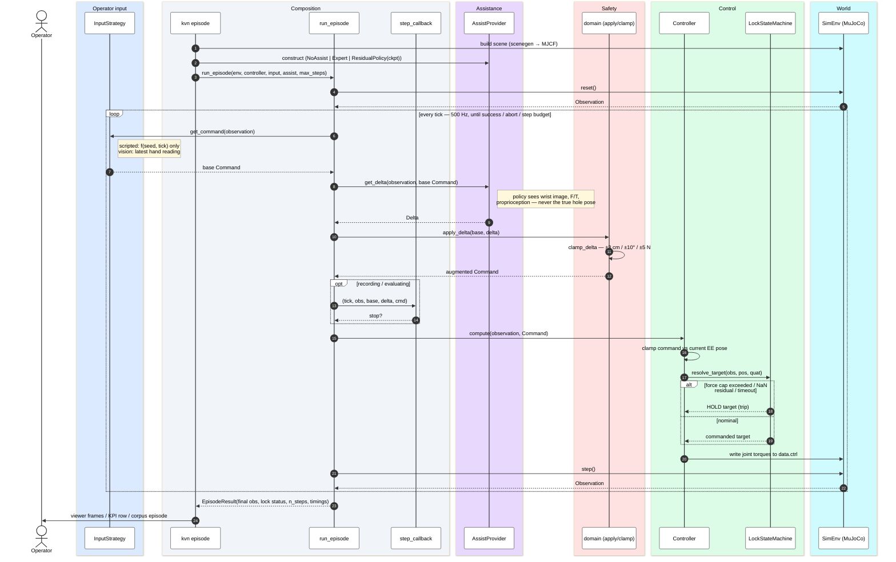

# Design Document

**AI-Assisted Robotic Teleoperation for Precision Insertion**
Workshop in Autonomous Systems Simulation (OpenU 20973) · final submission · solo project.

This is the submission design document required by the course booklet: requirements, system
architecture with an architectural diagram and a sequence chart, design alternatives with
justification, simulation scenarios, performance metrics, challenges and risks, the prototype,
evaluation criteria, and the timeline.

It is written to stand on its own. Where a subject has a deeper treatment in the repository,
the section links to it — [`docs/guides/architecture-tour.md`](./guides/architecture-tour.md) is the
code walkthrough,
[`docs/design/`](./design/) holds the per-subsystem rationale, and
[`docs/results/`](./results/kpi-dashboard.md) holds every measured result.

---

## 1. Project requirements

### 1.1 The problem

Teleoperation breaks down in the last few millimetres. Humans are good at coarse gross motion
and poor at fine alignment under uncertain, delayed, or indirect feedback — which is why
operators routinely fail at sub-centimetre contact-rich tasks (inserting a plug, a key, an
assembly pin). The system demonstrates, in simulation, that a learned *residual correction*
conditioned on wrist camera and contact force can absorb that last-millimetre error while the
human keeps authority over the gross motion.

The task is **peg-in-hole insertion**: an 8 mm peg, pre-grasped, into a ~10 mm chamfered bore
in a vertical wall carrying distractor holes, on a Franka Emika Panda in MuJoCo.

### 1.2 Functional requirements

| # | Requirement | Where it is realized |
|---|---|---|
| F1 | A human operator issues coarse pose commands to the end-effector — **position by default**, with 6-DoF orientation mirroring available behind `--orientation` | `input/vision_input.py` + [stereohand](https://github.com/NavehBrenner/stereohand) |
| F2 | A reproducible synthetic operator can stand in for the human, for benchmarking | `input/scripted_noisy_human.py` |
| F3 | An assistance layer adds a small correction on top of the operator's command, each tick | `domain/interfaces.py::AssistProvider` |
| F4 | Assistance is swappable at runtime between *none*, *analytical expert*, and *learned policy* | `kvn episode --policy {noassist,expert,tf}` |
| F5 | An always-on compliant controller converts the corrected command into joint torques | `control/backbone.py`, `control/impedance.py` |
| F6 | The system records episodes to a training corpus with a versioned on-disk contract | `data/`, [`data-schema.md`](./reference/data-schema.md) |
| F7 | A residual policy is trained from that corpus by behavioral cloning | `policy/train.py` |
| F8 | An evaluation harness runs paired trials and reports the KPIs of §5 | `eval/` |
| F9 | The runtime is observable — interactive viewer, per-phase timing, structured logs | `sim/scene.py::sync_viewer`, `--profile`, `common/log.py` |

### 1.3 Technical requirements and constraints

- **Simulation only.** MuJoCo, Franka Emika Panda, parallel gripper. No hardware, no ROS.
- **Pure Python ≥ 3.12.** No C/C++/Rust extensions. Lint (ruff), type-check (mypy), test (pytest)
  all gate every change.
- **Physics-rate control.** The loop runs at 500 Hz (`SIM_DT = 0.002`), one base command, one
  controller recompute and one `mj_step` per iteration — no wall-clock-dependent substepping,
  so a recording replays tick-for-tick.
- **Determinism.** Given a seed, an episode reproduces: the scripted operator is *open-loop*
  (its stream depends only on seed and tick, never on what the robot did), so two runs of one
  seed differ *only* in the assistance layer. This is what makes the paired ablation powerful.
- **Learning is behavioral cloning**, not reinforcement learning — the project's anti-scope.
- **Safety is structural, not statistical** (§1.4).

### 1.4 The safety envelope

Three layers, strongest first. The first is the one that matters: it is mechanical, so it holds
even if the learned policy emits garbage.

1. **Passive compliance.** The commanded restoring force is bounded by stiffness × the per-step
   command clamp: `[400, 400, 500]` N/m × 0.025 m gives **‖K·Δx‖ ≤ 18.9 N**. No command —
   including a maximally wrong network output — can ask for more than that.
   **This bounds the command, not the measurement.** The wrist F/T sensor reads the contact
   *reaction*, which carries impact transients the quasi-static argument does not cover; measured
   peaks reach 77.86 N on trials that hit the wall hard. Layer 3 exists precisely because layer 1
   does not bound that. Measured distributions:
   [`results/within-seed.md`](./results/within-seed.md).
2. **Hard clamps on the residual.** `clamp_delta` bounds every correction to **±3 cm position,
   ±10° orientation, ±5 N grip force per step**, applied *before* the controller sees the
   augmented command (`domain/delta.py`).
3. **Trip-and-lock watchdog.** `control/lock.py` monitors the runtime; exceeding the wrist-force
   cap (50 N in data generation, 30 N in evaluation), hitting the step budget, or a
   NaN/out-of-distribution residual drives the controller into **hold lock**, and the trial is
   recorded as a failure. **Park lock** returns the arm to a base pose between trials. This layer
   guarantees *termination* on a force breach, not that the breach cannot happen — 41% of
   evaluation trials end this way, across every arm including the unassisted baseline.

### 1.5 Expected outcomes

- A working integrated demo: webcam → hand tracking → robot, with assistance toggleable at runtime.
- A statistically defensible paired comparison of *assist off* vs *assist on* under a matched,
  seeded operator, reporting the KPIs of §5.
- A bound on the assist's authority that follows from the architecture rather than from measurement.
- The full booklet deliverable set: this document, a README, and runnable, tested code.

---

## 2. System architecture and key components

### 2.1 The idea in one paragraph

A human moves their hand; that becomes a coarse 6-DoF **base command**. A correction layer —
nothing, an analytical expert, or a trained policy — returns a small **delta** that is added on
top. The sum goes to an always-on impedance **controller**, which emits joint torques, and MuJoCo
steps. That loop runs at 500 Hz and lives in exactly one function
(`sim/runner.py::run_episode`). Everything else either *feeds* the loop (scene generation, input
strategies), *records* it (the corpus), *learns from the recording* (the policy), or *measures*
it (the eval harness).

### 2.2 Architectural diagram



**Reading the colours** — one colour per responsibility: **blue** = operator input · **yellow** =
the two `Protocol` seams · **purple** = the swappable assistance implementations · **red** = the
safety clamp · **green** = control · **cyan** = the simulated world · **grey** = the offline
data and measurement path.

The two yellow rounded nodes are the `Protocol`s, and they are the whole architecture: everything
purple is interchangeable behind one of them. The red node sits deliberately *between* the
assistance layer and the controller — that placement is the safety argument. The dashed
`step_callback` arrows are the *same* hook — the loop's only extension point, and how three
unrelated subsystems (corpus recording, KPI observation, DAgger relabelling) attach without the
loop knowing they exist.

### 2.3 Key components

| Layer | Package | Responsibility |
|---|---|---|
| Vocabulary | `common/` | `Observation`, `Command`, geometry, seating, logging. Imports nothing from `sim/`. The leaf of the dependency DAG. |
| Contracts | `domain/` | `Delta`, `apply_delta`, `clamp_delta`, `NoAssist`, and the two Protocols — the two `Protocol` definitions are 29 lines and carry the design. |
| Input | `input/` | Where a base command comes from: scripted operator, or stereo hand tracking split into a sensor half (`hand_tracker`) and a robot half (`vision_input`). |
| World | `sim/` | `SimEnv` (MuJoCo wrapper), `scenegen/` (procedural wall + hole field), and `runner.py` — the one composition loop. |
| Control | `control/` | Task-space impedance backbone, command clamps, hold/park lock watchdog. Always on, in every configuration. |
| Assistance | `expert/`, `policy/` | The analytical privileged-info expert (teacher) and the learned residual policy (student), both `AssistProvider`s. |
| Data | `data/` | Episode recording, the on-disk corpus contract, dataset assembly. |
| Measurement | `eval/` | Trial driver, per-trial KPI observer, paired-ablation report. |

**Why the seams sit here.** `NoAssist`, the expert and the trained policy are all
`AssistProvider`s, so swapping them is a *one-argument* change to the runner — no edit to the
controller, the input strategy, or the loop. That is the Dependency Inversion the project exists
to demonstrate, and it is exercised for real: the headline experiment is literally the same code
path run twice with a different `assist` argument. Full walkthrough:
[`architecture-tour.md`](./guides/architecture-tour.md).

<a id="runtime-contracts"></a>

**Four runtime contracts** are referenced by name from the source. They are stated here once and
nowhere else, so the code and the document cannot drift apart.

- **World frame and conventions.** World frame at the robot base, **z up**; every pose (EE, peg,
  hole, target) is reported in it. Quaternions are `(w, x, y, z)`, unit norm — MuJoCo's layout.
  SI throughout. The wrist F/T signal is **baselined at trial start**: with no contact the reading
  is dominated by the pre-grasped peg's weight, so the no-contact value is recorded and subtracted
  and the policy sees only contact-induced wrenches.
- **Residual policy interface.** The assist is a *pose-delta + grip-force-delta* layer on top of
  the active input command: Δposition (3-D, ±3 cm/step), Δorientation (3-D axis-angle, ±10°/step),
  Δgrip force (1-D, ±5 N/step). Clamping is enforced **before** the controller sees the augmented
  command, so the assist's authority is bounded whatever the policy emits (§1.4). All-zero deltas
  recover no-assist for free, and the analytical expert and the learned policy share this exact
  output signature — which is what makes them interchangeable.
- **Compliance profile.** Impedance control with **direction-dependent stiffness**: stiff along
  the insertion axis (push in), compliant laterally (the chamfered rim guides the peg — passive
  alignment), compliant in off-axis rotation (the peg can tilt to fit). On-axis yaw is irrelevant
  for a round peg. Translational stiffness is `[400, 400, 500]` N/m.
- **Runtime state — two modes only.** The controller is **mode-less in the autonomy sense**: it
  has no notion of task progress, success or failure. It is either **active** (input strategy in
  control, residual assisting) or **locked** — *hold lock* (frozen in place: safety trip, setup,
  manual pause) or *park lock* (returning to a known safe pose between trials). Trial-level
  concepts live in the evaluation harness, a passive observer that watches the runtime and
  computes KPIs offline. The controller has no dependency on the harness. That decoupling is the
  project's Dependency-Inversion pillar.

### 2.4 Sequence chart

One episode, from `kvn episode` to the recorded result. The inner block is the 500 Hz tick.



The participant boxes carry the same colours as the architecture diagram, so a lifeline can be
traced back to its responsibility: blue input, purple assistance, red safety, green control, cyan
world, grey composition.

Two things the chart is meant to make obvious. First, the clamp is applied **before** the
controller — the red lifeline sits between the purple one and the green one, so the safety bound
does not depend on the policy being well-behaved. Second, the policy is called with the
*pre-step* observation and never with privileged state: the expert may read the true hole pose,
the student may not, which is exactly what makes the imitation problem non-trivial.

---

### 2.5 The residual policy — the learned component

The one component the rest of the architecture exists to serve. Everything below is
`policy/model.py` and `policy/config.py`; the rationale behind each choice is §3.2–3.3 and
[`docs/design/policy-model.md`](./design/policy-model.md).

**What it maps.** Observation + current base command → a bounded correction `Delta`
(3 position + 3 orientation as axis-angle + 1 grip force = **7 outputs**). It never sees the true
hole pose; the analytical expert that teaches it does.

**Input streams**, concatenated per tick (early fusion):

| Stream | Width | Contents |
|---|---|---|
| Command | 9 | the operator's target pose this tick |
| Force / torque | 6 | wrist sensor — the contact signal |
| Proprioception | 24 | joint state + end-effector pose |
| *Image embedding* (Phase 2 only) | *128* | *wrist camera frame through a CNN* |

Phase 1 (F/T-only) is therefore a **39-wide** input and Phase 2 a **167-wide** one — the *only*
structural difference between the two phases, which is what makes the vision ablation a clean
comparison rather than a different model.

**The network.**

```
[streams] → concat → GRU(hidden 128, 2 layers) → MLP(128 → 128 → 7) → Delta
                       ↑ hidden state carried across ticks
```

The image encoder, when enabled, is a **MobileNetV3-Small** initialized from ImageNet weights and
used as a **frozen** feature extractor — every shipped vision checkpoint carries
`freeze_image_encoder: true`, because an 8 GB laptop cannot fine-tune at episode length (§6, C3).
A fine-tuned end-to-end variant was measured as a one-off ablation (`vision_stageC`) and did not
lift closed-loop success; see [mechanisms](./results/mechanisms.md#6-negative-results).

**Why recurrent.** A single stateful GRU core, not a fixed window over recent history. The
history matters because a *single* tick cannot distinguish "approaching the hole" from "jammed
against the wall" — the force signal only means something in context. §3.3 covers the alternative
and why it was rejected.

**The dual train/deploy contract.** The same weights are executed two ways, and they must agree:

- `forward(...)` — runs over a whole padded episode sequence for training, supervising *every*
  tick, with truncated BPTT over 256-step windows to bound memory on multi-thousand-step episodes.
- `step(...)` — O(1) per tick for the 500 Hz control loop: one observation in, one `Delta` and one
  updated hidden state out.

**How it is trained.** Behavioral cloning on the expert's per-step corrections: Adam at 1e-3,
early stopping on validation loss (patience 8), `ReduceLROnPlateau`, and an optional
**action-rate penalty** (squared first-difference of consecutive predicted Δ) that substantially
reduces the residual's trajectory-smoothness cost — jerk 153.6 → 85.7 at no success-rate cost,
against a human baseline of 45.6, so it narrows the gap rather than closing it. Training is
seeded end-to-end — weight init and batch order — with a regression test asserting that two runs
of one seed produce identical weights.

**One documented negative in the config.** `use_command_ee_delta` appends the
command-minus-actual tracking error to the proprioception stream. It *improves* the offline
metric and *collapses* closed-loop success — the policy amplifies a feedback feature into its own
tracking error. It is kept, defaulted off and commented, because a negative result that is
reachable is worth more than one that is deleted.

---

## 3. Design alternatives

The booklet asks, under *System Architecture and Key Components*, for **at least two valid
architectural approaches**, compared, with the final choice justified by trade-offs and technical
rationale. §3.1 is that comparison at the architectural level — where the autonomy sits, which is
the decision the whole system's shape follows from. §3.2 and §3.3 then record the two substantive
*component-level* decisions inside the chosen architecture, since the model is the project's
central artifact and its shape was not obvious either.

### 3.1 The top-level fork — where does the autonomy sit?

| | **A — Full autonomy** | **B — Traded / arbitrated control** | **C — Residual shared control** *(chosen)* |
|---|---|---|---|
| Shape | Policy plans and executes the whole insertion; human supervises | Human drives; an arbiter *hands over* to an autonomous controller near the hole | Human drives continuously; policy adds a bounded Δ every tick |
| Human authority | None during execution | Discrete — all or nothing, per phase | Continuous — human always dominates gross motion |
| Failure mode | Silent divergence; no human recovery path | Hand-off transients, mode confusion, "who is flying?" | Graceful — a wrong Δ is bounded and the human overrides it |
| Safety argument | Statistical (measure success rate) | Statistical, plus arbitration correctness | **Structural** — clamp + impedance bound the assist's *authority* regardless of the policy |
| What it demonstrates | Robot learning | Supervisory control | **Teleoperation assistance** — the actual thesis |
| Cost | Longest-horizon learning problem; needs RL or very large corpora | Extra arbitration subsystem and its own tuning surface | One extra Protocol; the loop is unchanged |

**Chosen: C.** Three reasons, in order of weight.

1. **It is the only one whose safety claim is arithmetic rather than statistical.** Under A and B
   the answer to "what if the network is wrong?" is a measurement. Under C it is arithmetic: the Δ
   is hard-clamped and the backbone is compliant, so a 100 %-wrong output cannot enlarge its own
   authority — the *commanded* restoring force stays under ≈18.9 N whatever the network emits.
   That bounds the command, not the measured contact reaction (§1.4). The property survived every
   negative result in the project (§6) and is the standing contribution.
2. **It matches the problem statement.** The claim is about *teleoperation* — that a human plus a
   small learned correction beats the human alone. A removes the human from the claim; B changes
   the claim to "when should the robot take over?", a different project.
3. **It is the cheapest change to the architecture.** C is one Protocol with three
   implementations and a one-argument swap. A and B both require a new subsystem (a planner, or
   an arbiter) with its own failure surface — real cost against a solo, fixed-deadline budget.

**What was given up.** C caps the ceiling: the assist can only ever correct within ±3 cm/±10° per
step, so it cannot rescue a grossly mis-aimed approach, and its measured benefit is bounded by
how much of the failure mass is last-millimetre error rather than gross mis-aim. That trade was
made deliberately, and the question of whether to spend further compute lifting that ceiling is
carried in [`docs/results/further-exploration.md`](./results/further-exploration.md).

### 3.2 Sub-decision — how the policy learns the operator's goal

*Full treatment: [`docs/design/policy-model.md`](./design/policy-model.md) §"Implicit vs explicit goal".*

- **Explicit (alternative).** A separate stage estimates a coarse target pose from the recent
  command stream and feeds it to the correction network as an extra input. More interpretable,
  more modular, debuggable — you can inspect the estimated goal.
- **Implicit (chosen).** The policy infers intent from the command history itself; there is no
  goal-estimation stage.

**Justification.** The explicit variant adds a hand-designed stage, a second failure surface and
a tuning burden, and it edges toward *assuming* an external intent-sensing system (eye-tracking-like)
that the project deliberately does not have. Implicit keeps the contribution a single learned
mapping from honest observation to correction. Explicit is retained as the documented fallback
and a natural ablation.

### 3.3 Sub-decision — the temporal architecture

*Full treatment: [`docs/design/policy-model.md`](./design/policy-model.md) Decision A.*

- **Windowed, separately-encoded streams with late fusion (alternative).** A per-stream encoder
  over a fixed last-*H* window, then fusion. Samples are i.i.d. windows, so batching is trivial
  and SGD is low-variance.
- **Single stateful GRU core over an early-fused observation (chosen).** One recurrent state,
  truncated-BPTT training, O(1) work per deployed step.

**Justification.** Windowed *training* must be paired with window re-encoding at *deploy* —
roughly 49 redundant re-encodings per tick, far worse once images are in the window — and pairing
windowed training with stateful deployment is a silent train/deploy distribution mismatch. The
stateful core makes training and deployment the same computation. The windowed design is retained
as the documented fallback if stateful training proves fiddly.

---

## 4. Simulation scenarios

The real-world situation being simulated is **remote manual assembly**: an operator with an
imperfect view and imperfect motor precision inserting a part into a receptacle, where contact
forces matter and a bad push damages the part.

### 4.1 The scene

Procedurally generated by `sim/scenegen/` and emitted as MJCF, so difficulty is a parameter
rather than a hand-edited file:

- Franka Emika Panda, parallel gripper, **peg pre-grasped** (grasping is not the contribution).
- A **vertical wall** carrying a field of round bores, each with a **rim chamfer**. `holes[0]` is
  the target; the rest are **distractors**, so the policy cannot succeed by simply finding "a hole".
- **Wrist-mounted RGB camera + wrist light** — the policy's only exteroceptive input.
- Wrist force/torque sensing and proprioception.

### 4.2 The two difficulty knobs

Deliberately orthogonal, which is what makes difficulty calibration principled rather than
fiddling — each was calibrated against the human-only baseline before any policy was trained:

| Knob | Stresses | Range used |
|---|---|---|
| **Clearance** (bore Ø − peg Ø) | position accuracy | 8 mm peg into ~10 mm bore |
| **Chamfer** (rim funnel width) | orientation accuracy | 5–9 mm |

Difficulty is calibrated so the **unassisted** operator has real headroom — an easy task would
make any assist look good, and an impossible one would make every assist look identical.

### 4.3 Per-trial randomization

Every trial resamples, from a fixed master seed list: hole pose (a small offset from the pose the
controller believes), initial arm pose, and the operator's noise realization. The operator's noise
is **structured and low-frequency** — a per-episode constant bias plus correlated drift at ~5–10 Hz —
not per-step i.i.d. Gaussian, which would reduce the expert to a trivial noise-negator. See
[`docs/design/human-generation.md`](./design/human-generation.md).

### 4.4 Operator modes

| Mode | Use |
|---|---|
| `--input scripted` | **Primary.** Seeded, open-loop, reproducible. All statistical claims come from this. |
| `--input vision` | Live: two webcams → MediaPipe → metric 3-D hand pose → base command. Qualitative demos and the video. |

---

## 5. Performance metrics

### 5.1 Per-trial KPIs

| KPI | Type | Why |
|---|---|---|
| **Insertion success** | bool | The headline metric. Scored on *sustained* seating, not first contact. |
| **Time-to-insert** | s | Efficiency; distinguishes "succeeded" from "succeeded before the budget ran out". |
| **Peak contact force** | N | Safety proxy — a **measurement**. What the architecture guarantees is the assist's *authority* (≤18.9 N commanded), not this number (§1.4). |
| **Trajectory smoothness** | integrated jerk | Whether the assist buys success at the cost of a jittery arm. |

A fifth KPI, **contact events before success**, was defined and is still recorded per trial. It
is **not reported**: it reads exactly 1 on every trial of every arm, `human_only` included, so at
this operating point it separates nothing. It stays in the recorded schema in case a future
operating point makes it informative.

Two of the four have a reading caveat, stated where they are reported (§5.3): time-to-insert is
defined only on seated trials, so a marginal mean is taken over each arm's own successes and is
not comparable across arms — the paired figure is. And the paired figures are the ones the
dashboard quotes.

A caveat the harness carries explicitly: data generation and evaluation share the *seating
geometry* (`common/seating.py`) but not the *decision rule* — data-gen scores success on the first
seated step, eval requires it sustained. Two success rates from the two paths are not the same
metric, and the dashboard labels which is which.

### 5.2 Experimental design

**Primary — scripted paired seeds (internal validity).** Each seed is run once with assistance
and once without. The command stream is identical across the pair, so the *only* difference is
whether the policy contributed. Zero operator variance, maximum statistical power, fully
reproducible.

**Secondary — live human trials (external validity).** The author teleoperates with and without
assistance. This shows the assist transfers to a real operator, but it is noisier and
lower-powered, so it is a bonus and not the core claim. Its two confounds — learning effect and
experimenter bias — are neutralized by counterbalanced ordering and, in the strongest form,
by blinding whether assistance is active. The scripted experiment sidesteps both entirely, which
is precisely why it is primary.

### 5.3 Reporting rule — a distribution, never a checkpoint

Training was initially unseeded: weight init and
batch shuffling came from OS entropy, so *two runs of the same command produced different
models*, while the run folder recorded a seed and a commit and therefore looked pinned.
Re-running one recipe across training seeds produced a **20–31 pp spread in success
rate** — larger than the effect any single checkpoint had appeared to show.

The consequence is a standing reporting rule:

> **A single checkpoint is not a measurement.** Every recipe is reported as a distribution over
> training seeds — mean ± range, with *n* and the noise floor printed beside it. Any single-seed
> figure is labelled as such.

Applied to the official multi-seed run — 1000-episode F/T and 500-episode vision corpora, all
four production recipes retrained across training seeds, each evaluated on the same 100 paired
held-out seeds — the answer is a **null**: no recipe lifts closed-loop insertion success
above the human-only baseline beyond training-seed noise (means of −4.4, +2.0, −8.3 and +1.3 pp
against a floor of 20–31 pp). The project's standing positive results are the **bounded assist
authority** (§1.4 — the residual's clamp and the ≤18.9 N commanded-force bound, both structural),
the **measured reduction in contact force and force-aborts under DAgger**, and the **mechanism
findings** explaining why per-step imitation cannot lift closed-loop seating on this task.

Per-experiment numbers are not reproduced here; they live in
[`docs/results/kpi-dashboard.md`](./results/kpi-dashboard.md) (the full M5→M7 experiment ledger),
with the levers already exhausted and the ones still worth trying in
[`docs/results/further-exploration.md`](./results/further-exploration.md).

---

## 6. Challenges and risks

Stated as they were encountered, with what actually happened.

| # | Challenge | Mitigation | Outcome |
|---|---|---|---|
| C1 | **A wrong policy damages the part** | Structural safety: clamp before the controller + passive compliance (§1.4) | **Held.** The bound on the assist's authority is architectural and survived every negative result; it does not bound measured contact force (§1.4). |
| C2 | **Unseeded training makes results irreproducible** | Seed every source of randomness; report distributions | **Realized, then fixed.** Seeding was added with a train-twice-identical-weights test; every closed-loop claim is now a distribution over seeds (§5.3). |
| C3 | **Vision BC is data-hungry** — more demonstrations than F/T-only | Pretrained CNN init, fine-tuned end-to-end; frozen-encoder fallback | **Realized.** An 8 GB laptop cannot fine-tune at episode length; frozen encoder at batch 2 fits, and rendering at ~10 fps capped the M7 ablation corpus (`dataset_vision`) at 300 episodes and the official vision corpus at 500. Recorded as an operating-point constraint, not hidden. |
| C4 | **The expert is a ceiling** — BC cannot exceed its teacher | Analytical expert with privileged info; expert recalibration sweeps | **Realized and bounded.** The better-expert lever was tested and refuted. |
| C5 | **Covariate shift** — BC drifts off the expert's state distribution | DAgger: on-policy rollouts relabelled by the expert | Implemented (`scripts/dagger.py`); rounds run as part of the official KPI run. |
| C6 | **Corpus/code drift** — a config fingerprint that hashes config but not code | Code era recorded as a caveat on the operating-point ledger; the claim in the data schema qualified | Documented; affected corpora identified and quarantined. |
| C7 | **Sim-only results don't transfer** | Explicit anti-scope: this is a simulation study, and says so | Accepted, stated, not papered over. |
| C8 | **Solo project, fixed deadline** | Phased scope with Phase 1 (F/T-only) as the guaranteed floor and Phase 2 (vision) as upside | Held — M1–M8 landed on schedule. |

BC and DAgger were both taken to their limits, perception was measured to be decoupled from
closed-loop success, and the expert ceiling was swept. What stands are the **bound on the assist's
authority** and the **mechanism findings**; what does not stand is a success-rate lift. That
distinction is drawn in [`results/mechanisms.md`](./results/mechanisms.md#7-what-still-stands).

---

## 7. Prototype and demo

The system is fully implemented and runnable.

```bash
./scripts/setup.sh                        # one-time (uv, Python 3.12)
uv run kvn episode --input scripted --policy noassist   # baseline, with viewer
uv run kvn episode --input scripted --policy tf \
    --checkpoint docs/results/checkpoints/ft/bc/seed_0/checkpoint.pt
uv run kvn episode --input vision --policy tf \
    --checkpoint docs/results/checkpoints/ft/bc/seed_0/checkpoint.pt  # live: two webcams → robot
```

Every command and flag: [`docs/guides/cli.md`](./guides/cli.md). Train / deploy / evaluate as
three runnable recipes, plus an inventory of every checkpoint:
[`docs/guides/policy-guide.md`](./guides/policy-guide.md).

### Demo media

Two artefacts accompany the submission, **recorded from the running system** rather than
reconstructed:

| Artefact | Content | Status |
|---|---|---|
| Demo video, 1–2 min | webcam → tracked hand → robot; assistance toggling on and off; a KPI summary | 🎬 *being recorded* |
| 3–5 live-teleoperation clips | full stereo-hand sessions, unedited, including the failures | 🎬 *being recorded* |

Both are committed under `assets/media/` and embedded in the README, so they are visible from the
repository page without cloning. The clips are deliberately not curated down to the successful
runs only — the failure modes are the more informative half, and §6 explains them.

---

## 8. Evaluation criteria

These are the success criteria as committed at the planning phase, **quoted unchanged**, each
against what was measured. Two of them were not met.

| # | Success criterion, as originally written | Verdict |
|---|---|---|
| 1 | *"Working integrated demo: webcam-driven teleop produces visible insertion attempts in MuJoCo, with assistance mode toggleable at runtime."* | ✅ **Met** |
| 2 | *"Phase 1 (F/T-only residual) outperforms human-only on success rate; peak force bounded by construction."* | ❌ **Not met** on success rate · ⚠️ **partly met** on the force clause — the *commanded* force is bounded (≤18.9 N) and the residual is clamped, but *measured* contact force is not; see §1.4 |
| 3 | *"Phase 2 (vision-conditioned residual) outperforms human-only on success rate **and** peak force, statistically meaningful; and beats Phase 1 (the vision ablation)."* | ❌ **Not met** |
| 4 | *"Architecture cleanly separates input layer / backbone controller / assistance layer; Strategy pattern at each seam; SOLID compliance defensible during the design review."* | ✅ **Met** |
| 5 | *"All booklet-required deliverables submitted on time and to professional quality, including self-evaluation writeup."* | 🎬 **In progress** — this document, the README and the code are complete; the demo media (§7) and the self-evaluation are being finished ahead of the 2026-08-31 deadline |

**On criteria 2 and 3 — what "not met" means here.** The residual does not outperform human-only
on success rate. Over the official multi-seed run the four recipes measure −4.4, +2.0, −8.3 and
+1.3 pp against a training-seed noise floor of 20–31 pp, so no arm clears it in either direction
(§5.3). Vision does not beat F/T-only either, at any operating point tested. Both criteria are
failed on their own terms, and the phrasing above is left exactly as it was written before any
result existed.

The part of criterion 2 that *was* met is the part that never depended on a sampled rate: the
residual's **authority** is bounded **by construction** (§1.4) rather than by measurement. The
per-step clamp and the backbone's stiffness cap the *commanded* restoring force at ≈18.9 N even
for a maximally wrong network output. The criterion's own wording — "peak force bounded by
construction" — reads as a claim about the *measured* contact force, and that does not hold: the
wrist sensor reads the contact reaction, which reaches 77.86 N on force-aborted trials. Hence
partly met rather than met.

What the arc produced instead of the lift is a mechanism-level account of *why* per-step imitation
cannot lift closed-loop seating on this task, and a measured reduction in contact force and
force-aborts under DAgger (see [conclusions](./conclusions.md)). Whether that is an adequate
substitute for the criterion is a judgement for the reader; this document's obligation is to state
the criterion as written and report that it was not achieved.

---

## 9. Timeline

Runway 2026-05-18 → 2026-08-31, ~15 weeks at 10–15 h/week. Milestone specs:
[`docs/specs/milestones.md`](./specs/milestones.md).

| Milestone | What | Status |
|---|---|---|
| M1 | Sim environment online — Panda, wall, wrist camera, procedural scene | ✅ done |
| M2 | Backbone controller online — task-space impedance, clamps, lock watchdog | ✅ done |
| M3 | Assistance seam + scripted operator — the two Protocols and the one loop | ✅ done |
| M4 | Expert + data generation — privileged-info teacher, corpus contract | ✅ done |
| M5 | Residual policy, Phase 1 (F/T-only) | ✅ done |
| M6 | Evaluation harness + Phase-1 results | ✅ done |
| M7 | Vision-conditioned residual, Phase 2 | ✅ done — closed as a documented negative |
| M8 | Human teleoperation input (stereo hand tracking) | ✅ done |
| M9 | Final evaluation + polish — official KPI run, this document, video, submission | 🟡 in progress |

**Work-plan note.** Phasing was deliberate: **Phase 1 (F/T-only residual) was the guaranteed
deliverable** and Phase 2 (vision) the upside, so a complete and defensible submission never
depended on the harder arc landing. M8 was independent of M5–M7 and could slip without
endangering the core result.

---

## Appendix — document map

| Question | Document |
|---|---|
| What came of it, in one read? | [`docs/conclusions.md`](./conclusions.md) |
| How do I find my way around `src/`? | [`docs/guides/architecture-tour.md`](./guides/architecture-tour.md) |
| What does every command do? | [`docs/guides/cli.md`](./guides/cli.md) |
| How do I train / deploy / evaluate a policy? | [`docs/guides/policy-guide.md`](./guides/policy-guide.md) |
| Why is each subsystem built this way? | [`docs/design/`](./design/) |
| What was measured, in what configuration? | [`docs/results/kpi-dashboard.md`](./results/kpi-dashboard.md) |
| What is on disk, in what format? | [`docs/reference/data-schema.md`](./reference/data-schema.md) |
| What was tried, and what might still work? | [`docs/results/further-exploration.md`](./results/further-exploration.md) |
