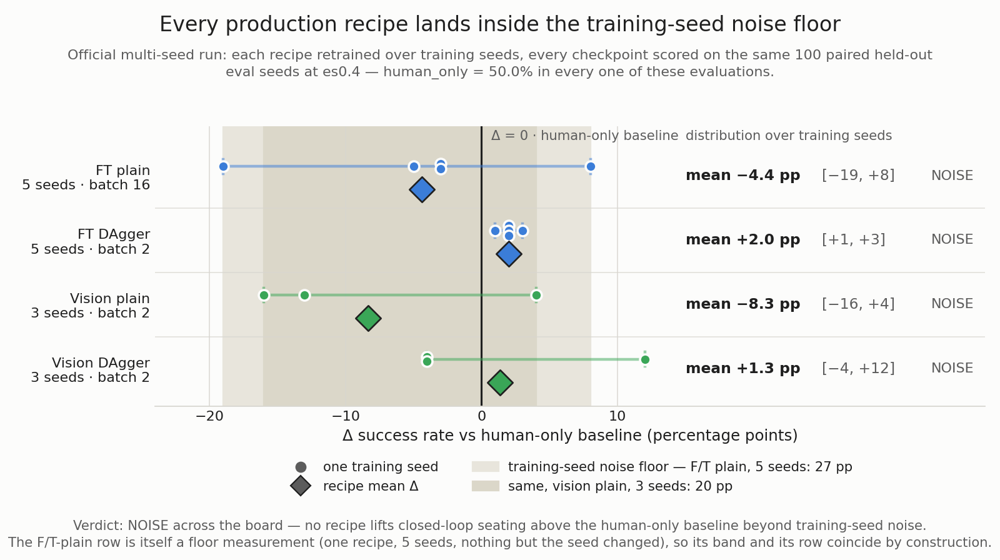

# KPI Dashboard — the M5→M7 experiment ledger

The consolidated record of every training and evaluation experiment behind the policy arc
(M5 first behavioral clone → M6 F/T residual → M7 vision + DAgger): what was tried, its
config, its measured result, and why it did or did not work. It exists because the numbers
that decide the project's story were scattered across `outputs/policy/runs/`, `runs/eval*/`,
and a private wiki, with no single document that reconciles them.

**Every number here is recomputed from the raw artifacts**, not copied from prose —
per-trial CSVs re-aggregated through `ai_teleop.eval.report`, training configs read from each
run's committed `metadata.json`. The reconstruction script and the exact paths are in
[§8](#8-provenance--how-to-regenerate). Where an artifact disagrees with the wiki, both values
are logged and the artifact wins.

> ## Read this first — the noise floor
>
> **Retraining one fixed recipe, changing only the training seed, moves closed-loop success by
> more than any treatment in this document.** Measured on the official corpus
> ([§5](#5-the-noise-floor--how-it-was-measured)): the F/T recipe over five seeds spans **27 pp**
> of paired Δ (−19 to +8); the vision recipe over three seeds spans **20 pp** (−16 to +4). An
> earlier, 5× smaller corpus gave **18 pp** over five seeds — the same order, on different data.
>
> The environment contributes none of it. The `human_only` arm uses no checkpoint and returns
> **exactly 50.0%** in all sixteen official evaluations — identical walls, operator, controller
> and budget. The spread is training randomness alone.
>
> That spread is this project's **measurement resolution**, and three rules follow:
>
> 1. **A single checkpoint is not a measurement.** Every closed-loop claim is reported as a
>    distribution over ≥3 training seeds, each carrying its `n`. A margin smaller than the seed
>    spread *plus* the eval-sampling interval at that n (±20 pp at n=20; ±10 pp at n=100) is a
>    **draw, not a finding** — flagged `NOISE` in the verdict column, never `WIN`/`REGRESSION`.
> 2. **A p-value inside one checkpoint pair says nothing about the recipe.** In the official run,
>    F/T seed 1 reads −19 pp at **p=0.0009** and vision-DAgger seed 1 reads +12 pp at **p=0.036**
>    — significant results pointing in *opposite* directions inside the same recipe families.
>    Significance there describes those two arms, not the recipe that produced them.
> 3. **The project's standing positive results are the bounded-force guarantee and the
>    mechanism findings** ([§7](#7-what-still-stands)) — *not* a success-rate lift, which on the
>    seeded measurement is not established.
>
> **Training was unseeded before 2026-07-23** — `torch.manual_seed` was absent and `--seed`
> reached only the train/val split, so weight init and batch order came from OS entropy while the
> run folder recorded a seed and a git commit. It is seeded now, with a
> train-twice-identical-weights test. Every pre-2026-07-23 number in this document is one
> unrepeatable draw and is listed as **history, not evidence**.
>
> One more, from finding H-11: **never compare an `expert_success_rate` to a residual success
> rate.** They are different actors, scored by different rules, at different difficulty — see
> the actor column in [§3](#3-training-runs-m5m7) and the note in [§2.3](#23-why-the-human-only-baseline-moves).

---

## 1. What the arc was trying to do

The policy is a **residual**: a human (here a scripted noisy operator) gives coarse 6-DoF
commands, and a behavioral-cloning-trained network adds a clamped micro-correction
(±2 cm / ±10° / ±5 N per step) on top of an always-on impedance backbone. The arc asked, in
order:

- **M5** — can a GRU clone the analytical expert's corrections at all? (offline BC)
- **M6** — does the F/T-only residual lift *closed-loop* insertion success over human-only?
- **M7** — does adding **vision** raise the success ceiling into the free-space regime, and can
  **DAgger** or a **better expert** push past the F/T ceiling?

**The answer to both closed-loop questions is no**, on the seeded multi-seed measurement (§5.5):
neither the F/T residual nor the vision residual lifts closed-loop success above the human-only
baseline beyond training-seed noise, with or without DAgger. What the arc contributes instead is
the bounded-force guarantee and a mechanism-level account of *why* per-step imitation cannot lift
closed-loop seating on this task (§6, §7). The numbers for both are below.

---

## 2. Operating-point ledger

Every closed-loop number is only interpretable against *which corpus trained the policy* and
*which difficulty the eval ran at*. These two tables are the key; the ledgers in §3–§4 point
back to them.

### 2.1 Corpus lineage (`data/dataset_*/metadata.json`)

| Corpus | Fingerprint | Created | n_ep | Schema | `expert_success_rate` | Role |
|---|---|---|---|---|---|---|
| `dataset_1` | `290f1750` | 2026-06-16 | 200 | 1.0 | — | M5 first BC (`lab34_baseline`). Old geometry/schema — **not comparable** to later corpora. |
| `dataset_9` | `54dccad9` | 2026-07-06 | 200 | 2.0 | 71.5% | Trained the 2026-07-07 M6 run. **Overwritten in place** — see caveat below. |
| `dataset_10` | `54dccad9` | 2026-07-22 | 200 | 2.0 | 71.5% | Regeneration of `dataset_9`'s config; trains every LAB-101/114 run. |
| `dataset_vision` | `de0eeb3b` | 2026-07-07 | 300 | 2.0 | 72.3% | All M6/M7 F/T + vision ablations (`ftonly_*`, `vision_*`). |
| `dagger_ft_agg` | `de0eeb3b` base | 2026-07-10 | 340→420 | 2.0 | — | Aggregated on-policy corpus, grows per DAgger round. |

**Two caveats the fingerprints hide:**

- **`dataset_9` and `dataset_10` share the fingerprint `54dccad9` but are not the same data**
  (finding G-4 / H-B). The fingerprint hashes *config*, not *code*; regenerating `dataset_9`'s
  config under 2026-07-22 code changed 35 of 200 trajectories (34 by a median of 1 step, one
  flipped baseline outcome, corpus baseline 22.5% → 23.0%). The original 2026-07-06 episode
  files were then **overwritten in place** by that regeneration — proven byte-for-byte by
  `scripts/dev/lab114_corpus_identity.py` — so `data/dataset_9/` now holds `dataset_10`'s
  arrays under `dataset_9`'s stale manifest. **The corpus that trained the 2026-07-07 M6 run no longer
  exists on disk.**
- **A "code era" column is load-bearing.** `dataset_0`/`dataset_1` (schema 1.0) already drift —
  their manifests predate `generated_walls` entering the fingerprint payload (finding C-1a).
  Do not trust byte-identical regeneration of any pre-LAB-91 corpus.

### 2.2 Eval operating points (`runs/eval*/trials.csv`)

| Eval set | `error_scale` | Seeds | Regime | `human_only` | Notes |
|---|---|---|---|---|---|
| `runs/eval/` (LAB-53) | 0.4 | 100 | in-band | **31.0%** | Older step-budget era (pre-LAB-100); zero force-aborts. |
| `eval_ftgate_es0p4` | 0.4 | 20 | in-band | 35.0% | M7 F/T gate ablation (3 arms). |
| `eval_ftgate_es1p0` | 1.0 | 20 | flat-wall | 15.0% | " |
| `eval_stageC_band04` | 0.4 | 20 | in-band | 35.0% | M7 Stage-C vision ablation (3 arms). |
| `eval_stageC` | 1.0 | 20 | flat-wall | 15.0% | " |
| `band_scale0.4` *(committed)* | 0.4 | 30 | in-band | **36.7%** | The 2026-07-07 M6 30-seed slice. |
| `flatwall_scale1.0` *(committed)* | 1.0 | 30 | flat-wall | 20.0% | That run's ceiling-check control. |
| `eval_lab101_band100*` | 0.4 | 100 | in-band | **50.0%** | LAB-101 reproduction (both ar0/ar100). |
| `eval_lab114_*` (×10) | 0.4 | 100 | in-band | **50.0%** | The seed-variance + H-B/H-C study. |

### 2.3 Why the `human_only` baseline moves

The three "contradictory" human baselines quoted across old docs — **36.7 / 31 / 50 / 35 / 15**
— are one number at different operating points, not a discrepancy:

- **50.0%** is the true in-band (es0.4) baseline, measured at 100 seeds, five independent times
  in LAB-114, all *exactly* 50.0% (the arm uses no checkpoint, so it is bit-stable).
- **36.7%** is that same baseline on the **hard 30-seed slice** (seeds 0–29) the 2026-07-07 run
  happened to draw: 36.7% on 0–29 vs 55.7% on 30–99.
- **31.0%** is the LAB-53 run at an **older step-budget era** (pre-LAB-100) — a different
  contact regime, not a different sample.
- **35% / 15%** are the 20-seed es0.4 / es1.0 baselines (M7 sets); es1.0 lands on the flat wall
  where nobody has a lateral lever, so everyone drops.

The stale `outputs/policy/kpi_report/kpi_comparison.json` (human **15.0%**, vision residual
`"PENDING"`) is a fourth operating point *and* an un-refreshed artifact; Phase-3 stage 3C
retires it. The lesson: **a bare success rate is meaningless without its (corpus, error_scale,
seed-count, step-budget-era) tuple.**

---

## 3. Training runs (M5→M7)

Reconstructed from `outputs/policy/runs/<name>/metadata.json`. `val` is `best_val_loss` at
`best_epoch/epochs_run`. **All GPU, seed 0, unless noted.** Offline val loss is *within-recipe*
predictive but **anti-predictive across interventions** (LAB-106) — do not rank recipes by it.

| Run | Date | Corpus (fp) | Config delta vs F/T baseline | `val` (epoch) | Closed-loop | Verdict |
|---|---|---|---|---|---|---|
| `lab34_baseline` | 06-18 | `dataset_1` (`290f`) | M5 first BC, schema-1.0 task | 0.00042 (12) | — no committed eval | offline milestone |
| `ftonly_baseline_lab82` | 07-07 | `dataset_vision` (`de0e`) | F/T residual, no action-rate penalty | 0.00149 (17) | see §4 (es0.4 20s) | M6/M7 F/T baseline |
| `ftonly_ar30` | 07-08 | `dataset_vision` | + action-rate penalty ×30 | 0.00116 (28) | — | jerk-reduction sweep |
| `ftonly_ar100` | 07-08 | `dataset_vision` | + action-rate penalty ×100 | 0.00140 (23) | 40% (es0.4, 20s) | the "old-ar100" M7 arm |
| `ftonly_wpos10_wd` | 07-10 | `dataset_vision` | pos-loss ×10 + weight-decay | 0.00169 (17) | — | LAB-106 offline fix (1/2) |
| `ftonly_gate_wpos10_wd` | 07-10 | `dataset_vision` | ↑ + **`command_ee_delta`** feedback feature + gate | 0.00135 (26) | **10%** (es0.4, 20s) | **REGRESSION** — see §6 |
| `vision_frozen_lab82` | 07-07 | `dataset_vision` | + vision, frozen MobileNetV3 encoder | 0.00107 (26) | — | best offline val of the arc — see caveat |
| `vision_frozen_ar100` | 07-08 | `dataset_vision` | ↑ + action-rate ×100 | 0.00123 (19) | — | |
| `vision_stageC` | 07-10 | `dataset_vision` | vision, **encoder unfrozen** (Stage C) | 0.00161 (16) | 40% in / 10% out (20s) | **NULL** — see §6 |
| `dagger_round0` | 07-10 | `dagger_ft_agg` (340) | on-policy relabel, round 0 | 0.00209 (20) | 40% (es0.4, 20s) | DAgger start |
| `dagger_round1` | 07-10 | `dagger_ft_agg` (380) | round 1 | 0.00214 (9) | 30% | **REGRESSION** (§6) |
| `dagger_round2` | 07-10 | `dagger_ft_agg` (420) | round 2 | 0.00194 (13) | 15% | **REGRESSION** (§6) |
| `probe_b2` | 07-07 | `dataset_vision_probe` (10) | vision batch-2 smoke probe | 0.00702 (2) | — | fits-in-8GB probe only |
| `lab101_ft_ar0_ds10` | 07-22 | `dataset_10` (`54dc`) | F/T recipe, GPU repro, ar0 | 0.00130 (22) | **−4.0 pp** (100s) | §5 |
| `lab101_ft_ar100_ds10` | 07-22 | `dataset_10` | ↑ + action-rate ×100 | 0.00178 (13) | **−9.0 pp** (100s) | §5 |
| `lab114_seed{0..4}` | 07-22 | `dataset_10` | F/T recipe, seeds 0–4 (**seeded**) | 0.00117–0.00197 | −15…+3 pp | §5 the spread |
| `lab114_ds9_seed{0..3}` | 07-22 | `dataset_9` | H-B corpus arm — **identical to `_seed`** | ≡ `lab114_seed*` | ≡ | H-B unanswerable |
| `lab114_cpu_seed0` | 07-22 | `dataset_10` | H-C device arm, CPU | 0.00144 (21) | −1.0 pp (100s) | H-C null |

**The offline-val trap, stated once.** `vision_frozen_lab82` has the *best* val loss of the
whole arc (0.00107) and is a closed-loop non-improver; the F/T recipe's own five seeds
span 18 pp of success at val losses 0.00117–0.00197. **A lower validation loss did not buy
closed-loop success across these interventions** — the central M7 mechanism (LAB-106,
[§7](#7-what-still-stands)).

---

## 4. Closed-loop experiment ledger

Reconstructed from the per-trial CSVs via `compare_paired`. Δ is paired (McNemar exact p);
`b/c` is discordant wins/losses. **Verdict uses the noise floor (§5):** `NOISE` = |Δ| within the
20–27 pp training-seed spread + the eval interval at that n.

| Eval set | Op. point | Arm | Success | Paired Δ (n, p) | Verdict |
|---|---|---|---|---|---|
| `flatwall_scale1.0` | es1.0, 30s | residual | 20.0% vs 20.0% | +0.0 pp (30, p=1.0) | flat-wall ceiling control (expected) |
| `runs/eval/` (LAB-53) | es0.4, 100s, old budget | residual | 43.0% vs 31.0% | +12.0 pp (100, p=0.043) | **NOISE** — inside the floor; unseeded training (H-7) |
| `eval_ftgate_es0p4` | es0.4, 20s | ar100 (`residual`) | 40.0% vs 35.0% | +5.0 pp (20, p=1.0) | **NOISE** |
| `eval_ftgate_es0p4` | es0.4, 20s | `command_ee_delta` (`ftonly`) | **10.0%** vs 35.0% | −25.0 pp (20, p=0.125) | **REGRESSION** (mechanism, §6) |
| `eval_ftgate_es1p0` | es1.0, 20s | ar100 / gate | 20% / 15% vs 15% | ≤+5 pp (20, p=1.0) | **NOISE** (flat wall) |
| `eval_stageC_band04` | es0.4, 20s | ftonly / **vision** | 40% / **40%** vs 35% | +5 / +5 pp (20, p=1.0) | **NULL** — vision ties F/T (§6) |
| `eval_stageC` | es1.0, 20s | ftonly / **vision** | 20% / **10%** vs 15% | +5 / −5 pp (20, p=1.0) | **NOISE** (margin < floor) |
| `eval_lab101_band100_ar0` | es0.4, 100s, `dataset_10` | residual | 46.0% vs 50.0% | **−4.0 pp** (100, p=0.557) | reproduction — §5 |
| `eval_lab101_band100` | es0.4, 100s, `dataset_10` | residual (ar100) | 41.0% vs 50.0% | **−9.0 pp** (100, p=0.136) | reproduction — §5 |
| `eval_lab114_seed2` | es0.4, 100s | residual | 35.0% vs 50.0% | **−15.0 pp** (100, **p=0.008**) | a *significant* regression from nothing but a seed — §5 |
| `eval_lab114_seed4` | es0.4, 100s | residual | 53.0% vs 50.0% | +3.0 pp (100, p=0.74) | the other end of the same spread |
| **`eval_official_ft_s*`** | es0.4, 100s, official corpus | residual ×5 seeds | 31–58% vs 50.0% | **mean −4.4 pp** [−19,+8] | **NOISE** (distribution — §5.5) |
| **`eval_official_dag_ft_s*`** | es0.4, 100s, official | residual ×5 seeds | 51–53% vs 50.0% | **mean +2.0 pp** [+1,+3] | **NOISE** (tightest — §5.5) |
| **`eval_official_vis_s*`** | es0.4, 100s, official | vision ×3 seeds | 34–54% vs 50.0% | **mean −8.3 pp** [−16,+4] | **NOISE** (§5.5) |
| **`eval_official_dag_vis_s*`** | es0.4, 100s, official | vision ×3 seeds | 46–62% vs 50.0% | **mean +1.3 pp** [−4,+12] | **NOISE** (§5.5) |

The Stage-C DAgger rounds (`eval` per round, 20s es0.4) read **40% → 30% → 15%** across rounds
0–2 — the round-to-round steps are inside the noise floor, but the round-0-to-round-3 drop and
the parallel rollout-success decline (0.325 → 0.25) are the real signal (§6).

---

## 5. The noise floor — how it was measured

Every comparison in this document is a difference between two success rates. Before any
difference can mean anything, one number has to be established: **how far apart can two runs of
the *same* recipe land?** That is the floor, and it is measured, not assumed.

**The design.** Fix a recipe — same corpus, same hyperparameters, same everything. Train it N
times, varying only the **training seed**, which controls weight initialization and batch
shuffling order. Evaluate every resulting checkpoint on the **same** 100 paired held-out eval
seeds against `human_only`. Any spread in the outcome is attributable to training randomness and
nothing else.

**On the official corpus** (`dataset_official_ft` / `_vision`, 1000 episodes, es0.4, 100 paired
eval seeds — the same data every production recipe was trained on):

| Recipe | train seed | treatment success | paired Δ | p |
|---|---|---|---|---|
| F/T | 0 | 47.0% | −3.0 pp | 0.711 |
| F/T | 1 | **31.0%** | **−19.0 pp** | **0.0009** |
| F/T | 2 | 58.0% | +8.0 pp | 0.115 |
| F/T | 3 | 47.0% | −3.0 pp | 0.678 |
| F/T | 4 | 45.0% | −5.0 pp | 0.458 |
| **F/T spread** | 5 seeds | 31–58% | **27 pp** [−19, +8] | |
| vision | 0 | 37.0% | −13.0 pp | 0.041 |
| vision | 1 | 34.0% | −16.0 pp | 0.009 |
| vision | 2 | 54.0% | +4.0 pp | 0.503 |
| **vision spread** | 3 seeds | 34–54% | **20 pp** [−16, +4] | |

**The environment is exonerated.** `human_only` uses no checkpoint and returned **exactly 50.0%
in every one of these evaluations** — identical walls, operator, controller config, step budget
and scoring. The checkpoint is the only variable.

**Seed 1 is the point.** On its own it reads as a strongly significant regression, p=0.0009,
produced by nothing but a different random initialization. Read seed 1 alone and you would
report a broken recipe; read seed 2 alone and you would report an +8 pp win. Neither is true.
The same trap fires positive elsewhere — vision-DAgger seed 1 (§5.5) reads **+12 pp at p=0.036**
while its two sibling seeds both read −4.

**Corroborated on independent data.** The floor was first measured (LAB-114, 2026-07-22) on
`dataset_10` — a 5× smaller, 200-episode corpus with a different master seed — giving a **18 pp**
spread over five seeds (paired Δ −15 to +3, records in `phase-1/lab114/`). Two corpora, two
generations of the pipeline, the same order of magnitude. The floor is a property of the task
and the recipe, not of any one dataset.

**Why it existed unmeasured for so long.** Training was **unseeded** until 2026-07-23:
`torch.manual_seed` was never called, and `--seed` reached only the train/val split — so weight
init and batch order came from OS entropy while each run folder faithfully recorded a seed and a
git commit. Two runs of the same command produced different models and the artifacts could not
show it. Fixed in one line, with a train-twice-identical-weights regression test. Results
predating that fix are single unrepeatable draws and are marked as history throughout this
document.

**A free result worth keeping.** Across the five `dataset_10` seeds, `best_val_loss` vs
closed-loop success is Spearman **ρ = −0.82** (p=0.089, n=5): offline loss is directionally
predictive *within one recipe*, the opposite of its behavior *across* interventions (§6).
Selecting the best-val checkpoint of a fixed recipe is therefore fine; tuning *recipes* by val
loss is not.


---

## 5.5 The official multi-seed run — the definitive measurement

§5 established the measurement resolution; this section is the measurement the project stands
on. Per the D-6 mandate: a fresh **~1000-episode** official corpus (F/T
and vision, separate), each of the four production recipes **retrained over multiple seeds** and
reported as a **distribution**, evaluated on 100 paired held-out seeds at the es0.4 operating
point. Seed families are disjoint by construction, so every Δ below is genuine held-out **test**
(corpus master-seed 100; DAgger rollouts 300/301/302; eval walls seed 0). Re-aggregate with
`scripts/dev/official_kpi/aggregate.py`.

| Recipe | seeds (n) | batch | `human_only` | treatment success | **mean Δ** | range | verdict vs floor |
|---|---|---|---|---|---|---|---|
| **FT plain** | 5 | 16 | 50.0% | 31–58% | **−4.4 pp** | [−19, +8] | **NOISE** |
| **FT DAgger** | 5 | 2 | 50.0% | 51–53% | **+2.0 pp** | [+1, +3] | **NOISE** (all 5 seeds ≥ 0, but see the confound below) |
| **Vision plain** | 3 | 2 | 50.0% | 34–54% | **−8.3 pp** | [−16, +4] | **NOISE** |
| **Vision DAgger** | 3 | 2 | 50.0% | 46–62% | **+1.3 pp** | [−4, +12] | **NOISE** |



*The same table as a picture: one row per recipe, one dot per training seed, the diamond the
recipe mean, the bar its observed range. The shaded bands are the noise floor **measured in this
same run** — F/T plain over 5 seeds (27 pp) and vision plain over 3 (20 pp), each a
one-recipe-many-seeds measurement in which nothing but the training seed changed. Every recipe
mean falls inside them, which is the result. Regenerate with
`uv run python scripts/dev/official_kpi/plot_seed_spread.py` (§8).*

**No recipe clears the floor.** The FT-plain row *is* the floor — it is the same
one-recipe-many-seeds measurement as §5, and its 27 pp spread swallows every mean in the table.
The honest reading of all four rows is one sentence: **on the seeded measurement, none of
{F/T, vision} × {plain BC, DAgger} lifts closed-loop seating above the human-only baseline
beyond training-seed noise.**

Two second-order structure notes, one of them qualified:

- **DAgger appears to tighten the distribution without moving its center** — both DAgger arms
  show a narrower seed spread (FT: [−19,+8]→[+1,+3]; vision: [−16,+4]→[−4,+12], barely) around a
  mean a hair above zero. FT DAgger is the only arm where all five seeds land non-negative.
  **⚠️ In the F/T arm this claim is confounded:** plain trained at **batch 16**, DAgger at
  **batch 2**, so the two arms differ in *two* variables and an 8× smaller batch is itself a
  large change to optimization noise. The vision arm is clean on batch size (both at 2) and
  there the tightening is much weaker — which is itself evidence that batch size is doing some
  of the work. A batch-2 FT-plain re-run is the outstanding measurement that would separate them.
  Either way +2 pp is inside the floor, so this is at most a tighter draw of the same null, never
  a win. (Contrast the small-corpus DAgger collapse in §6, which was dominated by force-abort
  states the bounded expert couldn't relabel — the larger, cleaner corpus removes the degradation
  but adds no lift.)
- **The noise lives on *both* axes.** Re-evaluating each intermediate DAgger round on the same
  100 held-out walls (per-round `trials.csv`, LAB-112 backfill) shows the paired Δ swinging
  *within a single training seed* across rounds — seed-0 vision-DAgger ran **−1 → −28 → −12 → +8
  → −4** over rounds 0–4, a 36 pp range with no trend. A single round's checkpoint is as much a
  lottery draw as a single seed. Reported KPI is the **pre-committed final round**, never
  max-over-rounds (that is the LAB-114 optimistic-selection bias re-introduced on a new axis).

**Full KPI, not just success** (treatment arm, mean across seeds at es0.4):

| Recipe | peak contact force | ∫\|jerk\| (h = 45.6) |
|---|---|---|
| FT plain | 25.8 N | 70.1 |
| FT DAgger | 22.9 N | 85.1 |
| Vision plain | 24.7 N | 57.2 |
| Vision DAgger | 23.5 N | **48.0** |

**Peak force stays inside the ~24 N envelope for every recipe** — the bounded-force guarantee
(§7) holds on the official run by construction, independent of the success null. Jerk is raised
by every treatment (the known residual-costs-smoothness cost, §6), *least*
by Vision DAgger (48.0 vs human 45.6, effectively flat) — the `--action-rate-weight 100` penalty
plus DAgger's on-policy smoothing nearly erase the jerk cost. So the smoothness regression is a
solved problem at the operating point; it is the success lift that does not materialize.

**This is the arc's closing measurement.** It does not overturn §7 — the standing positives never
rested on a success rate — and it converts the documented negative from "one unreproducible
checkpoint" into a rigorous, multi-seed, fresh-corpus null. See
[`further-exploration.md`](further-exploration.md) for what (if anything) is worth further
compute.

---

## 6. Negative results

Surfacing the failures is an explicit goal of this document — each is a mechanism, not just a
missing win.

- **Action-rate penalty — works exactly as designed, and it is *not* the arc's problem.**
  `ar0` vs `ar100` on `dataset_10` are indistinguishable on success (46% vs 41%, inside the
  floor) but jerk drops **153.6 → 85.7** (p<1e-15). The penalty buys smoothness at no success
  cost — which *retires* the "apply the action-rate penalty" candidate:
  it was already applied and does nothing to success.
- **The offline-fix collapse (`command_ee_delta`) — REGRESSION, and the sharpest mechanism.**
  Adding a `(command − ee_position)` **feedback feature** + pos-loss ×10 drove offline error
  below the zero-Δ baseline for the first time (7.6 → 3.5 mm) — and closed-loop success
  **collapsed to 10%** (`ftonly_gate_wpos10_wd`, es0.4, vs 35% human), with *more* force-aborts.
  Online, the policy amplifies its own tracking error into wall-slams. **A more accurate
  imitator is a worse controller** — offline BC fidelity is *anti*-correlated with closed-loop
  success on this task (LAB-106).
- **DAgger degrades, it doesn't rescue — REGRESSION.** Three F/T rounds on the ar100 base:
  **40% → 30% → 15%** (rollout success 0.325 → 0.25). Mechanism: the policy's rollouts are
  dominated by force-abort states, and the **bounded analytical expert cannot demonstrate a
  recovery** from a peg pinned at the force cap — so each round aggregates more failure states
  labeled with passive Δ, and the clone gets more passive. DAgger's founding premise (a
  competent expert on visited states) is structurally violated.
- **Stage-C vision fine-tune — NULL.** Unfreezing the image encoder (`vision_stageC`) ties
  F/T-only in-band (40% vs 40%, es0.4) and loses out-of-band (10% vs 20%, es1.0, inside the
  floor). Vision carries little marginal signal because **the operator command already proxies
  the hole location** (LAB-77 identifiability); the free-space correction the clone would learn
  is ≈0 by construction.
- **A better analytical expert — REFUTED (LAB-108).** Five expert knobs meant to prevent the
  slam were all inert; the expert's own ceiling stayed at ~73.3%. The binding constraint is
  operator-originated, pre-contact force-abort, which a bounded residual cannot fix.

---

## 7. What still stands

Two classes of result do **not** rest on a sampled success rate, so LAB-114 leaves them intact.
These are the project's standing positives.

- **The bounded-force guarantee.** The residual is hard-clamped (±5 N/step) and the impedance
  backbone bounds contact force mechanically, so even a 100%-wrong network output cannot exceed
  the envelope. Peak contact force was **never exceeded across any trial in any eval set** —
  this is a property of the controller, proven by construction, not an estimated rate.
- **The mechanism findings**, each theory or a byte-identical/exact probe:
  - **Identifiability ceiling** (LAB-77) — the operator command proxies the hole; a no-vision
    residual cannot lift success outside the chamfer band. A structurally-flat flat-wall delta
    is a *result*, not a failure.
  - **Far-field gating failure** (LAB-106) — trained GRUs emit a ~5.6 mm correction floor
    across the ~60% free-space steps where the expert is exactly zero.
  - **Offline/closed-loop anti-correlation** (LAB-106) — fixing offline BC error made
    closed-loop worse; only a closed-loop ablation is a valid signal here.
  - **The bounded-expert/DAgger argument** (LAB-105/106) — on-policy relabeling can only teach
    what the expert can perform, and it cannot un-jam a force-aborted peg.

An honest engineering summary: **Phase 1 delivers a provably safe assist and a mechanized
account of why per-step imitation cannot lift closed-loop seating success on this task. The
success-rate *lift* is, on the seeded measurement, not established.**

---

## 8. Provenance & how to regenerate

Every table above is a pure function of committed artifacts. Re-aggregate any eval set:

```bash
# One eval set → success + paired McNemar + per-KPI Wilcoxon, from raw per-trial rows.
uv run python scripts/report_results.py --trials runs/eval_lab101_band100_ar0/trials.csv

# The committed Phase-1 records (30-seed slice, flat-wall, seed-variance, H-C) live here:
ls docs/results/phase-1/*.csv docs/results/phase-1/lab114/

# The §5.5 official multi-seed distributions (all four recipes, over training seeds):
uv run python scripts/dev/official_kpi/aggregate.py       # reads runs/eval_official_*

# The §5.5 figure — same statistics, plotted against the measured floor:
uv run python scripts/dev/official_kpi/plot_seed_spread.py   # → docs/results/phase-1/official_multiseed_deltas.png
```

The §5.5 official-run eval sets (`runs/eval_official_*`) and per-round DAgger `trials.csv`
(`outputs/policy/runs/dag_*_s*/dagger_round*/`) are **local artifacts, gitignored** like the rest
of `runs/`/`outputs/` — the committed record is the §5.5 tables and figure plus `aggregate.py` /
`plot_seed_spread.py` (both read-only over those dirs; the figure is regenerable only while they
exist locally). The chunk
scripts that produced them are `scripts/dev/official_kpi/*.sh` (self-resumable, self-timing).

Training configs are each run's committed `outputs/policy/runs/<name>/metadata.json`. Post-G1
runs carry a `checkpoint_sha256`; the two pre-G1 checkpoints behind published numbers are
committed under `docs/results/phase-1/checkpoints/` (retention policy: that dir's README).

**Three provenance gaps this ledger inherits, stated so no reader trusts a number past them:**

| Gap | Finding | Consequence |
|---|---|---|
| The 2026-07-07 M6 **checkpoint** is gone | H-8 (`outputs/` gitignored) | 70.0% cannot be re-evaluated. |
| That run's **corpus** was overwritten in place | H-B / G-4 | `dataset_9`'s trajectories are unrecoverable. |
| `dataset_0`/`dataset_1` fingerprints predate `generated_walls` | C-1a | Pre-LAB-91 corpora do not regenerate byte-identically. |

The reconstruction that built §3–§4 is a read-only sweep over `outputs/policy/runs/`,
`runs/eval*/`, and `data/dataset_*/` — see the LAB-114 evidence scripts
(`scripts/dev/lab114_corpus_identity.py`, `lab114_weight_distance.py`) and the report audit
(`scripts/dev/lab42_report_audit.py`).

---

**See also:** [`architecture-tour.md`](../guides/architecture-tour.md) (where each of
these modules lives).
