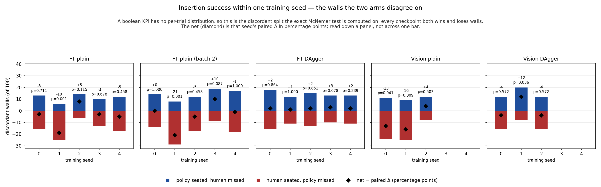
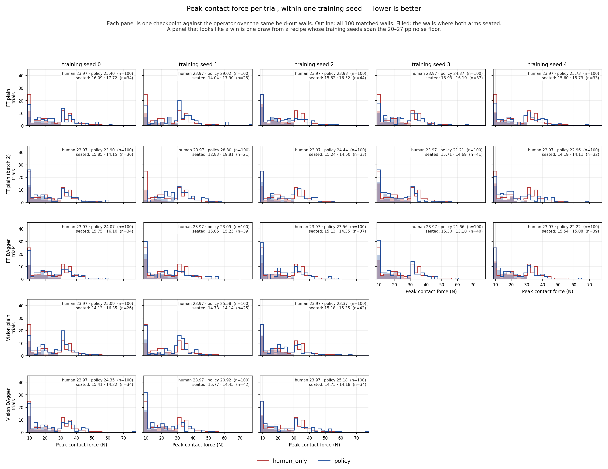
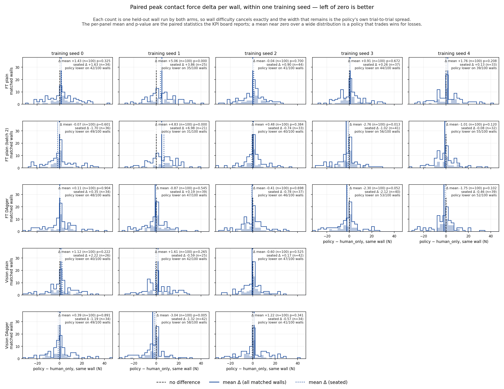
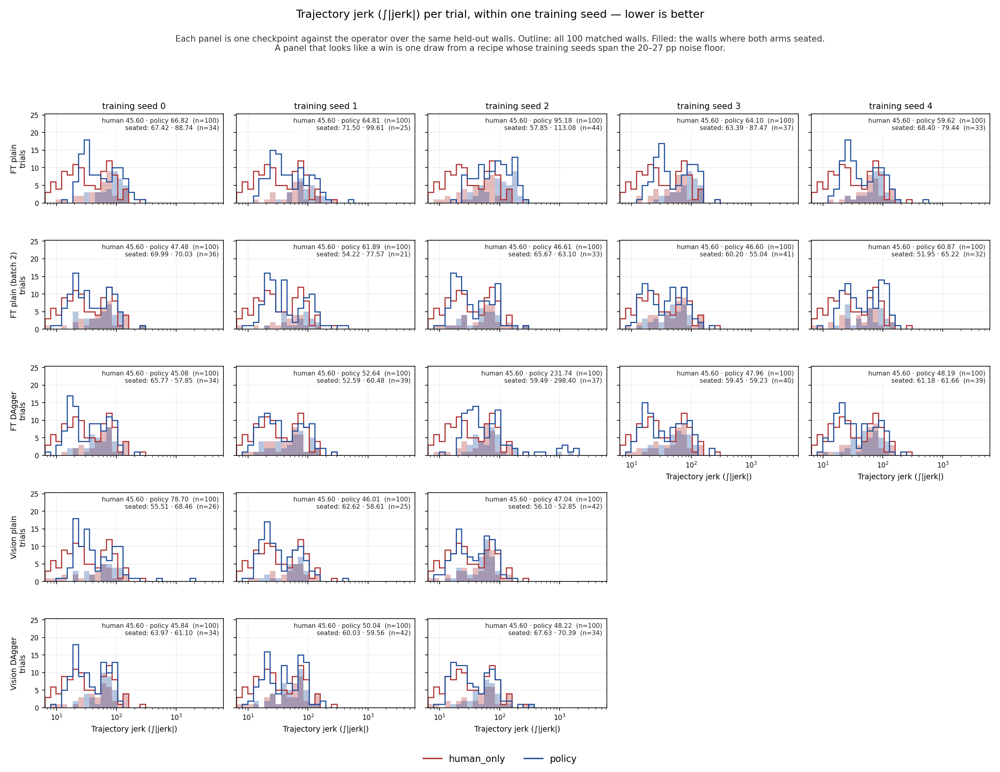
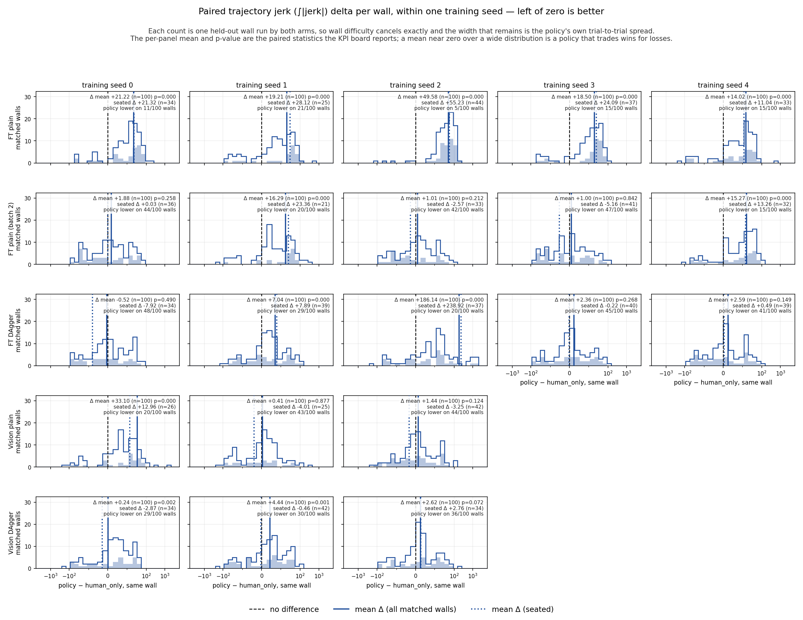
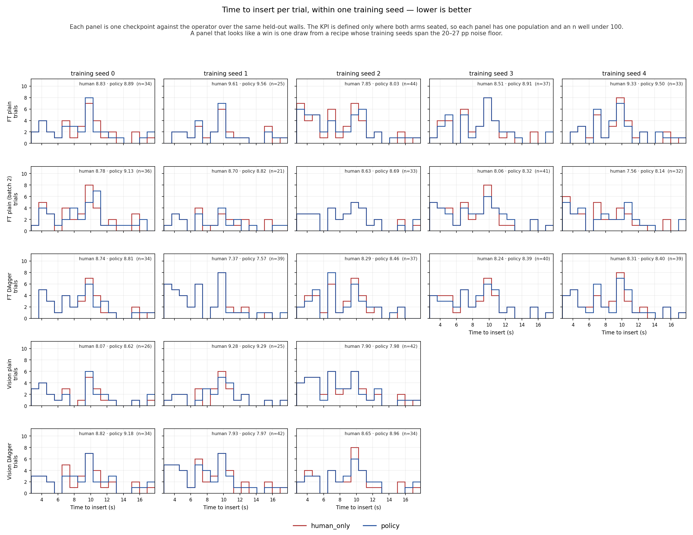
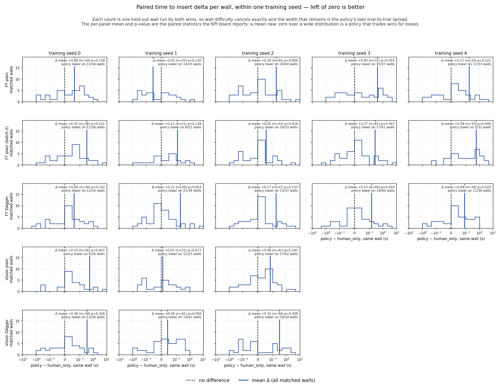

# Within a Single Seed — the policy against the operator, trial by trial

**The within-seed question, and it is a different one.** Every other results file plots a
distribution over *training seeds*, where one point is a seed's mean across 100 trials —
answering *how much does retraining move the average?* This file holds the checkpoint
fixed and looks at the individual trials, answering *how does this one policy compare to
the human operator, wall by wall?*

The two answers differ, and the most visible way is that a mean can describe no trial that
ran: peak contact force is bimodal, so its average falls in the trough between the two
modes.

The page has two halves. [§5.6.2](#562-the-distribution-behind-the-force-mean) pools every
seed of a recipe and asks what one *trial* looks like. [§5.6.3](#563-two-views-per-training-seed)
holds one **training seed** fixed and puts both views — absolute distributions and paired
per-wall deltas — on **every** KPI, which is where the wall-by-wall question is actually
answered.

**Related:** [experiment ledger](experiment-ledger.md) · [noise floor](noise-floor.md) ·
[KPI board](kpi-board.md) · [mechanisms](mechanisms.md) · [index](kpi-dashboard.md)

---

### 5.6.2 The distribution behind the force mean

Every chart above plots a distribution over **training seeds**, where one point is a seed's mean
over 100 trials — it answers *how much does retraining move the average?* This one plots the
**individual trials**, which answers a different question and gives a different answer.

***Figure 6 — peak contact force per trial, by arm and outcome.** Green line: the ≈18.9 N
commanded-force bound (stiffness × command clamp). Black dashed: the 30 N watchdog abort.
**What to conclude:** the distribution is bimodal and the mean falls between its two modes.*

**The mean describes no trial that ran.** Peak force is **bimodal** — a seated cluster below
~20 N and a force-abort cluster above 30 N — so `human_only`'s 23.97 N mean sits in the trough
between them. Its per-trial spread is **8.60 to 54.70 N, SD 12.51**, against a spread across
training seeds of **exactly zero** (it uses no checkpoint, so all 21 evals return the identical
number). Those are two different variances and only one of them is what the other figures show.

**The 30 N line is visibly a cut, not a ceiling.** Successes and timeouts stop dead at it and
force-aborts begin there, because exceeding it *is* what makes a trial a `force_abort`. The
recorded peak on those trials runs to **77.86 N** — the force spikes within the tick before the
watchdog fires.

**The ≈18.9 N commanded-force bound is not a bound on the measurement.** 33% of *successful*
trials sit above it. The quasi-static `K·Δx` argument bounds what the controller can *ask for*;
the F/T sensor reads the contact reaction, which carries impact transients and the full distal
load. Both statements are true and they are about different quantities — [what stands](mechanisms.md#7-what-still-stands) now separates them.

**The policies' worst impacts are harder than the human's** (max 64–78 N against 54.70 N) while
their *rate* of hard impacts is lower for both DAgger arms. Fewer bad contacts, but a heavier
tail when one happens.

Regenerate with `uv run python scripts/dev/official_kpi/plot_trial_forces.py`.

---

### 5.6.3 Two views, per training seed

The figure above pools every seed of a recipe into one histogram. That is the right picture for
"what does a trial look like", and the wrong one for "what did *this checkpoint* do" — pooling
five checkpoints hides that they disagree. The figures below split by training seed and give
every reported KPI two views:

- **View A — absolute per-trial distributions** (`within_seed_trials_<kpi>.png`). `human_only`
  and the policy over the same 100 held-out walls, one panel per training seed. This is the shape
  the seed-level mean is taken over.
- **View B — paired per-trial deltas** (`within_seed_delta_<kpi>.png`). `policy − human_only`
  computed **on the same wall** — matched by the eval-wall seed, the same pairing the reported
  statistics use. Wall difficulty cancels exactly; what remains is the policy's own contribution.

Success is boolean, so a per-trial "delta" could only be −1/0/+1 and a histogram of it would say
nothing. It gets the **McNemar discordance** instead — the counts of walls each arm won, which is
what the exact test is computed on and whose difference *is* the paired Δ.

**Fixing the seed removes the lottery from the picture, not from the result.** Several panels
below show a checkpoint that looks clearly better than the operator. Each is one draw from a
recipe whose seeds span the **20–27 pp** success-rate noise floor ([noise floor](noise-floor.md)),
and the panel beside it usually shows the opposite. Reading one panel as a result is the selection
trap the seed-level figures exist to prevent.

Regenerate all seven with `uv run python scripts/dev/official_kpi/plot_within_seed.py`.

#### Success — the walls the two arms disagree on

***Figure 7 — success discordance per training seed.** Blue above the line: walls the policy
seated that `human_only` missed. Red below: walls `human_only` seated that the policy missed. The
diamond is the net, which over 100 paired walls is exactly that seed's paired Δ in percentage
points; the p-value is the exact McNemar test over the discordant split. **What to conclude:** the
residual changes the outcome on a large minority of walls in every recipe — **20 to 37 walls of
100 flip** — while the net stays inside ±21 pp. A near-zero Δ is not a policy that does nothing;
it is a policy that wins and loses in nearly equal numbers.*

**The tight FT-DAgger band is a property of the rate, not of the walls.** The
[KPI board](kpi-board.md) reports FT DAgger's five seeds landing in a 2 pp band where plain BC
spans 27–31 pp, and reads that as DAgger making the outcome *predictable*. Per wall it is not:
those five checkpoints flip **34, 23, 28, 23 and 24** walls respectively, for nets of +2, +1, +2,
+3, +2. Each reshuffles roughly a quarter of the wall set and lands in the same place.
Predictable in aggregate, not in detail.

**The regressions are equally concrete.** `FT plain (batch 2)` seed 1 seats 8 walls the human
missed and misses 29 the human seated (−21 pp, p=0.001); its sibling seed 3 seats 19 and misses 9
(+10 pp, p=0.087). Same corpus, same hyperparameters, same 100 walls — only the training seed
differs.

#### Peak contact force

***Figure 8 — peak contact force per trial, per training seed (View A).** Outline: all 100 matched
walls. Filled: the walls where both arms seated. **What to conclude:** the bimodality of Figure 6
holds in every individual panel — a seated cluster below ~20 N, a force-abort cluster above 30 N —
and the filled subset sits entirely in the lower mode. The `human_only` mean of 23.97 N, identical
in all 21 panels because the baseline uses no checkpoint, falls in the trough between them.*

The seated-only baseline is **not** a constant: the same operator's mean over the intersection
runs **12.83 to 16.09 N** across panels, because which walls are in the intersection depends on
the policy it is being compared against. A seated-only comparison needs its reference line drawn
per panel — which is what [§5.6.1](kpi-board.md#561-the-same-kpis-on-the-success-group-only) does.

***Figure 9 — paired peak-force delta per wall (View B).** Solid line: the mean over all matched
walls — the number the KPI board reports, with its Wilcoxon p. Dotted: the mean over the seated
subset. **What to conclude:** the force reductions that survive the seed-level averaging are
**not** uniform per-wall improvements. Even where the mean drops most — `FT DAgger` seed 3 at
−2.30 N — the policy is the gentler arm on only **53 of 100** walls; across all 21 checkpoints
that count runs **31 to 58 of 100**, close to a coin flip on every one. The mean is carried by a
minority of walls with large reductions, not by a systematically softer contact.*

The sign is not stable within a recipe either: `FT plain (batch 2)` seed 1 reads **+4.83 N,
p<0.001** and seed 3 reads **−2.76 N, p=0.013** — two significant results in opposite directions
from one recipe. That is the training-seed noise floor showing up in a continuous KPI, and it is
why force is quoted as a range over seeds rather than as a number.

#### Trajectory jerk (∫|jerk|)

***Figure 10 — ∫|jerk| per trial, per training seed (View A), logarithmic axis.** The per-trial
values span three decades (6.4 to 6128), so a linear axis collapses every panel into one bar; the
axis is logarithmic and nothing is clipped. **What to conclude:** jerk is bimodal too, and the
filled subset — walls where both arms seated — occupies the **upper** mode almost exclusively. The
low-jerk mode is the failures: a run that aborts early accumulates less corrective motion. That is
the mechanism behind §5.6.1's observation that `human_only`'s jerk *rises* from 45.60 to 64.90 on
the seated subset.*

***Figure 11 — paired ∫|jerk| delta per wall (View B), symmetric-log axis.** Linear across zero,
logarithmic in the wings, so the bulk stays resolved while the outlier tail stays on the same axis.
**What to conclude:** the smoothness cost is the one KPI that is a **per-wall property rather than
an average**. `FT plain` is the rougher arm on 79 to 95 of 100 walls (policy-lower counts 11, 21,
5, 15, 15); `Vision DAgger`, whose seed-level mean reads as nearly flat, is still rougher on 64 to
71 walls (29, 30, 36). A mean of +0.24 at p=0.002 — `Vision DAgger` seed 0 — is not a null: it is
a systematic per-wall regression whose mean is pulled back to zero by a handful of large
improvements.*

That last case is the clearest argument on this page for reading the paired test rather than the
difference of means. The mean says "indistinguishable"; the rank test and the wall counts agree
that it is not.

#### Time to insert

***Figure 12 — time to insert per trial, per training seed (View A).** This KPI exists only on
trials that seated, so a matched pair needs **both** arms to seat and each panel prints its n:
**21 to 44** walls, never 100. **What to conclude:** the two arms' seating times overlap almost
completely; the difference the KPI board reports is a shift of a fraction of a second inside a
distribution running from under 4 s to over 17 s.*

***Figure 13 — paired time-to-insert delta per wall (View B), symmetric-log axis.** One count per
wall that **both** arms seated. **What to conclude:** the slowdown reported as +0.14 to +0.27 s on
the recipe means is visible per wall: the policy is the faster arm on fewer than half the shared
walls for **18 of the 21** checkpoints, down to **5 of 32** (`FT plain (batch 2)` seed 4, Δ +0.58 s,
p<0.001). The distribution is centred just right of zero with a long right tail, not shifted as a
block.*

#### What the within-seed view adds

1. **A near-zero Δ is not an inert policy.** Every checkpoint flips the outcome on 20–37 walls of
   100. The residual is doing a great deal; it is not doing it in one direction.
2. **FT DAgger's "predictability" is about the rate, not the walls** — 23–34 walls change outcome
   per checkpoint behind a 2 pp band of nets.
3. **The force advantage is a minority effect, not a uniform one** — lower on 31–58 walls of 100
   everywhere, including the checkpoints with the largest mean reductions.
4. **The jerk cost is the opposite: near-universal per wall** (rougher on up to 95 of 100), and
   present even where the seed-level mean reads flat.
5. **Both always-on KPIs are bimodal and the modes are outcomes** — force separates seated from
   force-aborted, jerk separates seated from aborted-early. Any all-trials mean is a mixture
   weighted by how often that arm fails, which is why the seated-subset split exists.
6. **Nothing here lifts the null.** Individual panels look like wins — `Vision DAgger` seed 1 is
   +12 pp, −3.04 N at p=0.005, gentler on 58 of 100 walls — and its two sibling seeds both read
   −4 pp on the same walls.

**On the force framing.** Nothing on this page bounds the measured contact force. The bimodality
is produced by the 30 N watchdog *cut* and the force-abort mode reaches 77.86 N; what is bounded
is the *commanded* restoring force (≤18.9 N) and the residual's own clamp — see
[what stands](mechanisms.md#7-what-still-stands).

